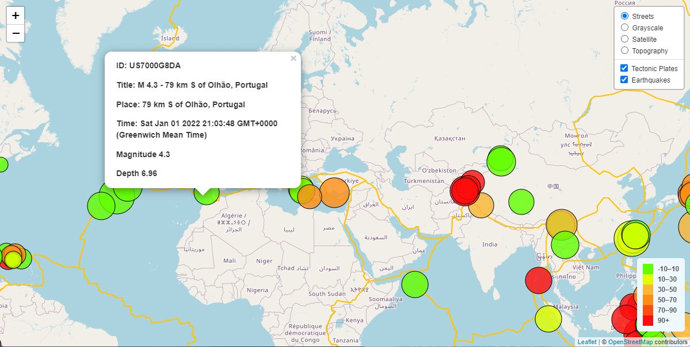

# Visualising Earthquake Data using Leaflet.js

### Summary
The USGS provides a live data feed of earthquake in GeoJSON format -
[USGS Earthquake Feed](https://earthquake.usgs.gov/earthquakes/feed/v1.0/geojson.php).

I wanted to display this data on a map to enable visual analysis of eathquake activity and get clear visual indicators of where earthquakes occur most frequently and the severity of the earthquakes. This can assist in identifying hazardous and high risk areas of seismic activity.

Tectonic plate lines were also marked on the map to get a visual indicator of the relationship between the plates and locations of seismic activity.

# Real-time Interactive JavaScript Map

## [Click Here to View Map](https://github.com/Abzraja/leaflet-javascript-geojson)

Interactive Map created using [Leaflet](https://leafletjs.com/) JavaScript library and [OpenStreetMap Tile Layers](https://wiki.openstreetmap.org/wiki/Tile_servers).

Real earthquake data was imported from [USGS](https://www.usgs.gov/) in [GeoJSON](https://earthquake.usgs.gov/earthquakes/feed/v1.0/geojson.php) format and added to the map.

* The map is interactive and has a few different base layers that can be toggled such as Street Maps and Satellite maps.

* The data layers such as tectonic plates and earthquakes can also be toggled on and off.

* Earthquake indicators can be clicked to show a pop up box containing details of the Earthquake such as time and place, and magnitude and depth.

* The size of the earthquake indicators is based on the Magnitude of the earthquake.

* The colour of the indicators is based on the depth of the earthquake.

 
 

 

### Abz Raja
abzraja@gmail.com